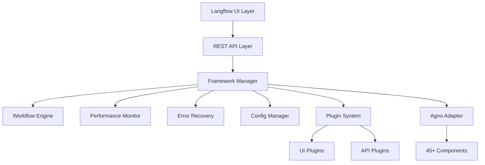
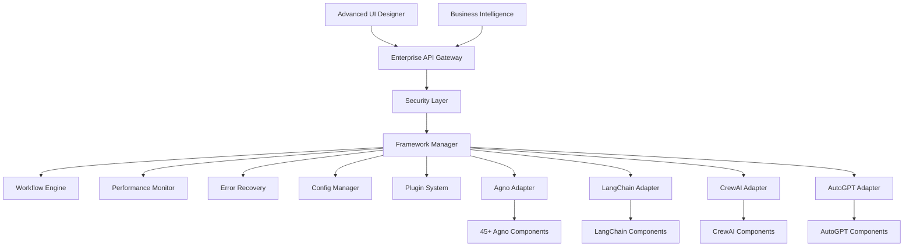

# Phase-4 Implementation Plan: Enterprise Features & Ecosystem Expansion

## 🎯 Overview

Phase-4 represents the enterprise enhancement and ecosystem expansion phase of the Agno Framework Integration project. With the core framework architecture now complete and production-ready, Phase-4 focuses on adding enterprise-grade features, expanding the ecosystem with additional framework adapters, and creating advanced UI/UX capabilities.

## 📊 Current Status

### ✅ Completed Phases
- **Phase-1**: Foundation framework architecture
- **Phase-2**: Real Agno component integration with 45+ components
- **Phase-3**: Advanced features (workflow engine, monitoring, error recovery, API layer, plugin system)

### 🎯 Phase-4 Objectives
- Enterprise security and compliance features
- Additional AI framework adapters (LangChain, CrewAI, AutoGPT)
- Advanced UI/UX components and workflow designer
- Business intelligence and reporting capabilities
- Cloud deployment and scaling optimizations
- Community and ecosystem expansion

## 🏗️ Architecture Enhancements

### Current Architecture (Post Phase-3)


### Target Architecture (Phase-4)


## 📋 Implementation Roadmap

### Week 1-2: Enterprise Security Foundation
**Deliverables:**
- [ ] Advanced authentication system (SSO, OAUTH2, LDAP)
- [ ] Role-based access control (RBAC) implementation
- [ ] Audit trail and compliance logging
- [ ] Data encryption and secrets management enhancement
- [ ] Security scanning and vulnerability assessment

**Files to Create:**
- `src/backend/base/langflow/core/frameworks/security/`
  - `authentication.py` - Advanced auth providers
  - `authorization.py` - RBAC implementation
  - `audit.py` - Audit trail system
  - `encryption.py` - Enhanced encryption utilities
  - `compliance.py` - Compliance reporting

### Week 3-4: LangChain Framework Adapter
**Deliverables:**
- [ ] LangChain framework adapter implementation
- [ ] Component discovery and registry for LangChain
- [ ] Integration with existing workflow engine
- [ ] Cross-framework compatibility validation
- [ ] Performance optimization for multi-framework scenarios

**Files to Create:**
- `src/backend/base/langflow/core/frameworks/langchain/`
  - `langchain_adapter.py` - Main adapter implementation
  - `langchain_components.py` - Component registry
  - `langchain_integration.py` - Integration helpers
  - `langchain_tests.py` - Comprehensive testing

### Week 5-6: Advanced UI Components
**Deliverables:**
- [ ] Visual workflow designer with drag-and-drop
- [ ] Real-time monitoring dashboards
- [ ] Component marketplace interface
- [ ] Advanced configuration wizards
- [ ] Multi-framework workflow visualization

**Files to Create:**
- `src/frontend/advanced-ui/`
  - `workflow-designer/` - Visual workflow editor
  - `monitoring-dashboard/` - Real-time dashboards
  - `component-marketplace/` - Plugin marketplace
  - `config-wizard/` - Configuration helpers
  - `multi-framework-view/` - Cross-framework UI

### Week 7-8: Business Intelligence & Reporting
**Deliverables:**
- [ ] Analytics and reporting engine
- [ ] Performance metrics and KPI tracking
- [ ] Cost analysis and optimization recommendations
- [ ] Custom dashboard creation tools
- [ ] Data export and integration capabilities

**Files to Create:**
- `src/backend/base/langflow/core/frameworks/intelligence/`
  - `analytics_engine.py` - Core analytics processing
  - `reporting.py` - Report generation system
  - `kpi_tracker.py` - KPI monitoring and tracking
  - `cost_analyzer.py` - Cost analysis and optimization
  - `dashboard_builder.py` - Custom dashboard tools

### Week 9-10: CrewAI Framework Adapter
**Deliverables:**
- [ ] CrewAI framework adapter implementation
- [ ] Multi-agent system integration
- [ ] Team-based workflow orchestration
- [ ] Agent communication and coordination
- [ ] Performance optimization for multi-agent scenarios

**Files to Create:**
- `src/backend/base/langflow/core/frameworks/crewai/`
  - `crewai_adapter.py` - Main adapter implementation
  - `crewai_components.py` - Component registry
  - `crewai_teams.py` - Team management system
  - `crewai_coordination.py` - Agent coordination
  - `crewai_tests.py` - Comprehensive testing

### Week 11-12: Cloud Deployment & Scaling
**Deliverables:**
- [ ] Kubernetes deployment configurations
- [ ] Auto-scaling and load balancing
- [ ] Multi-region deployment support
- [ ] Cloud provider integrations (AWS, Azure, GCP)
- [ ] Monitoring and observability in cloud environments

**Files to Create:**
- `deploy/cloud/`
  - `kubernetes/` - K8s deployment configs
  - `terraform/` - Infrastructure as code
  - `docker/` - Container configurations
  - `monitoring/` - Cloud monitoring setup
  - `scaling/` - Auto-scaling configurations

## 🔧 Technical Requirements

### Enterprise Security
- **Authentication**: Multi-provider SSO, OAUTH2, LDAP integration
- **Authorization**: Fine-grained RBAC with role inheritance
- **Audit**: Comprehensive logging of all user actions and system events
- **Encryption**: End-to-end encryption for data in transit and at rest
- **Compliance**: GDPR, SOC2, HIPAA compliance features

### Multi-Framework Support
- **LangChain**: Full component library integration
- **CrewAI**: Multi-agent team coordination
- **AutoGPT**: Autonomous agent workflows
- **Cross-Framework**: Unified API and workflow orchestration

### Advanced UI/UX
- **Workflow Designer**: Visual drag-and-drop interface
- **Real-time Monitoring**: Live dashboards and metrics
- **Component Marketplace**: Plugin discovery and installation
- **Responsive Design**: Mobile-friendly interface
- **Accessibility**: WCAG 2.1 AA compliance

### Business Intelligence
- **Analytics**: Comprehensive usage and performance analytics
- **Reporting**: Automated report generation and scheduling
- **KPI Tracking**: Custom metrics and key performance indicators
- **Cost Analysis**: Resource usage and cost optimization
- **Forecasting**: Predictive analytics and capacity planning

## 📊 Success Metrics

### Technical Metrics
- [ ] **Multi-Framework Support**: 4+ AI frameworks integrated
- [ ] **Security Compliance**: SOC2, GDPR compliance certification
- [ ] **Performance**: Sub-100ms cross-framework component execution
- [ ] **Scalability**: Support for 1000+ concurrent workflows
- [ ] **Reliability**: 99.9% uptime with advanced monitoring

### User Experience Metrics
- [ ] **UI Usability**: <30s workflow creation time
- [ ] **Learning Curve**: <2 hours for new user onboarding
- [ ] **Feature Adoption**: >80% adoption of advanced features
- [ ] **User Satisfaction**: >4.5/5 user satisfaction score
- [ ] **Performance**: <2s page load times for all UI components

### Business Metrics
- [ ] **Enterprise Readiness**: Production deployment in 3+ enterprises
- [ ] **Community Growth**: 1000+ active community members
- [ ] **Plugin Ecosystem**: 50+ community-developed plugins
- [ ] **Market Penetration**: Integration with major cloud platforms
- [ ] **Revenue Impact**: Measurable ROI for enterprise customers

## 🛠️ Development Guidelines

### Code Quality Standards
- **Test Coverage**: Maintain >95% test coverage for all new code
- **Documentation**: Comprehensive API documentation and user guides
- **Performance**: All components must meet performance benchmarks
- **Security**: Security review required for all enterprise features
- **Accessibility**: UI components must meet accessibility standards

### Architecture Principles
- **Modularity**: All features implemented as pluggable modules
- **Scalability**: Design for horizontal scaling from day one
- **Security**: Security-first approach for all enterprise features
- **Compatibility**: Maintain backward compatibility with existing APIs
- **Extensibility**: Plugin architecture for third-party extensions

### Testing Strategy
- **Unit Tests**: Component-level testing for all modules
- **Integration Tests**: Cross-framework integration testing
- **Performance Tests**: Load testing and benchmarking
- **Security Tests**: Penetration testing and vulnerability assessment
- **UI Tests**: Automated browser testing for all UI components

## 📚 Documentation Plan

### Enterprise Documentation
- [ ] **Enterprise Setup Guide**: Complete enterprise deployment guide
- [ ] **Security Configuration**: Security best practices and configuration
- [ ] **Multi-Framework Guide**: Using multiple frameworks together
- [ ] **Cloud Deployment**: Cloud-specific deployment instructions
- [ ] **Performance Tuning**: Advanced performance optimization

### Developer Documentation
- [ ] **Plugin Development**: Creating custom plugins and extensions
- [ ] **API Reference**: Complete API documentation with examples
- [ ] **Framework Integration**: Adding new framework adapters
- [ ] **Contributing Guide**: Community contribution guidelines
- [ ] **Architecture Guide**: Deep dive into system architecture

### User Documentation
- [ ] **User Manual**: Comprehensive user guide with tutorials
- [ ] **Workflow Designer**: Visual workflow creation guide
- [ ] **Dashboard Configuration**: Custom dashboard creation
- [ ] **Troubleshooting**: Common issues and solutions
- [ ] **Best Practices**: Recommended patterns and practices

## 🚀 Getting Started

### Prerequisites
- Completed Phase-1, Phase-2, and Phase-3 implementation
- Development environment with Python 3.9+, Node.js 16+
- Access to cloud platforms for deployment testing
- Enterprise security tools for compliance testing

### Development Environment Setup
```bash
# Clone and setup Phase-4 development environment
git checkout -b feature/phase4-enterprise

# Install additional dependencies
pip install -r requirements-phase4.txt
npm install --save-dev enterprise-ui-components

# Setup enterprise development environment
cp .env.enterprise.template .env.enterprise
source scripts/setup-enterprise-dev.sh
```

### Implementation Order
1. **Start with Security Foundation**: Implement enterprise security features first
2. **Add LangChain Support**: Expand framework ecosystem gradually
3. **Enhance UI Components**: Build advanced user interfaces
4. **Implement Business Intelligence**: Add analytics and reporting
5. **Complete CrewAI Integration**: Multi-agent system support
6. **Finalize Cloud Deployment**: Production-ready deployment options

### Testing and Validation
```bash
# Run Phase-4 test suite
make test-phase4

# Validate enterprise security features
make test-security

# Test multi-framework integration
make test-multi-framework

# Performance benchmark testing
make benchmark-phase4
```

## 🎯 Expected Outcomes

### Technical Deliverables
- Enterprise-grade security and compliance features
- Multi-framework support (Agno, LangChain, CrewAI, AutoGPT)
- Advanced UI components with visual workflow designer
- Comprehensive business intelligence and reporting
- Cloud-native deployment and scaling capabilities
- Robust plugin ecosystem and marketplace

### Business Value
- **Enterprise Readiness**: Production deployment capability for large organizations
- **Market Differentiation**: Unique multi-framework AI orchestration platform
- **Ecosystem Growth**: Thriving community and plugin marketplace
- **Revenue Generation**: Enterprise features drive commercial adoption
- **Strategic Positioning**: Leader in AI workflow orchestration space

### Community Impact
- **Developer Experience**: Best-in-class developer tools and documentation
- **Ecosystem Growth**: Active community contribution and plugin development
- **Industry Standards**: Establish patterns for AI framework integration
- **Knowledge Sharing**: Comprehensive documentation and best practices
- **Innovation Platform**: Foundation for future AI orchestration innovations

---

**🎯 Phase-4 Goal**: Transform the Agno Framework Integration into a comprehensive, enterprise-ready, multi-framework AI orchestration platform that serves as the foundation for next-generation AI workflow management.

**📈 Success Criteria**: Enterprise deployment readiness, multi-framework ecosystem, advanced UI capabilities, comprehensive business intelligence, and thriving community ecosystem.

**🚀 Ready to Begin**: Phase-4 implementation can begin immediately with the security foundation, building upon the solid Phase-3 completion.
